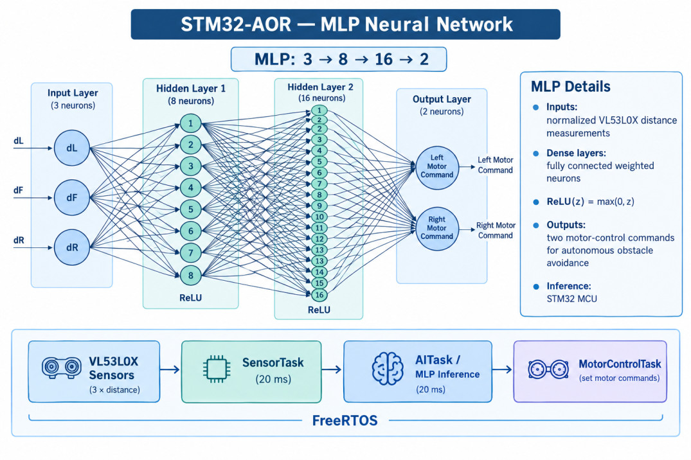
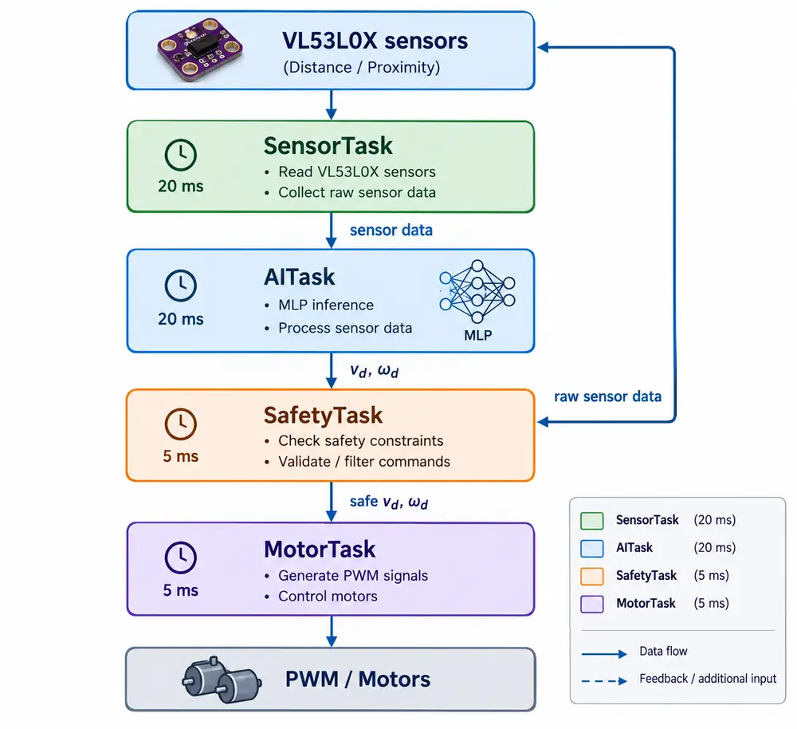
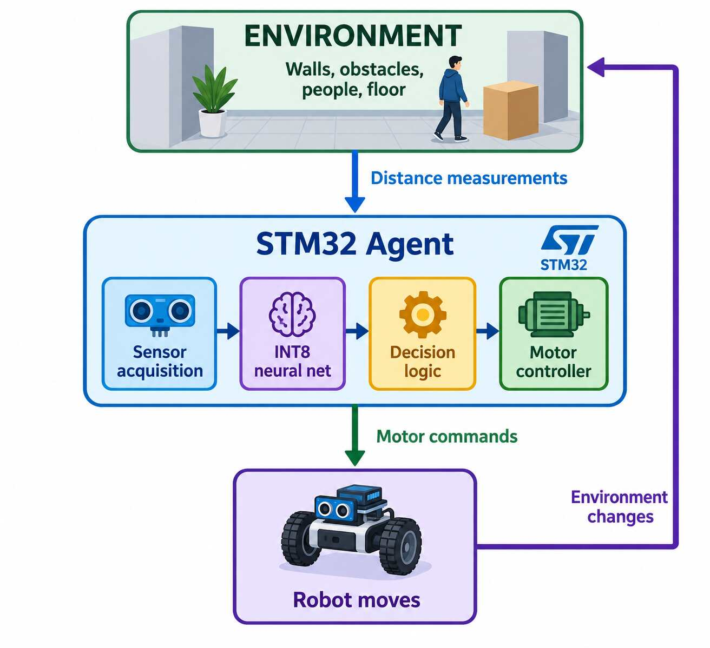
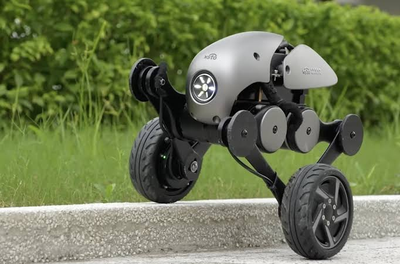
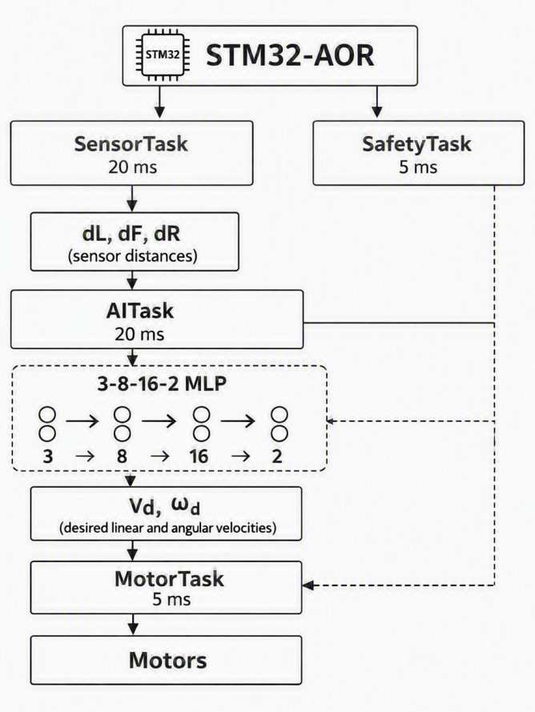
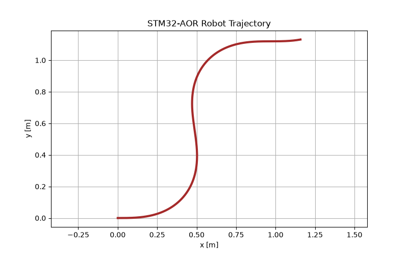
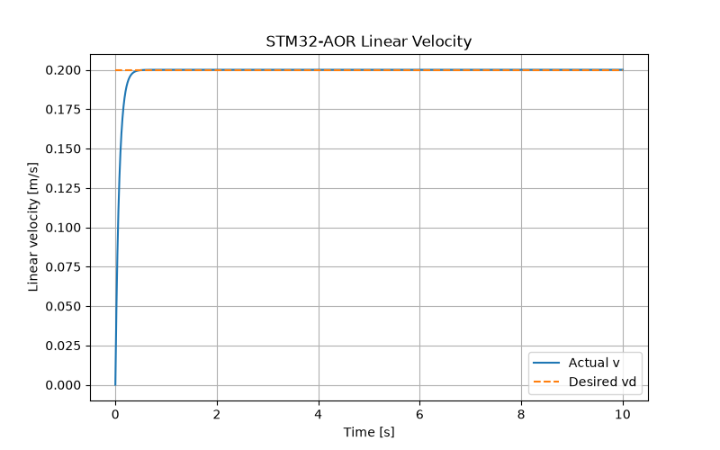
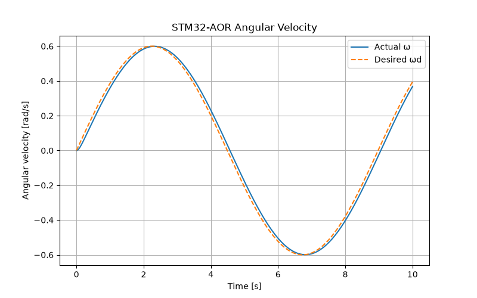
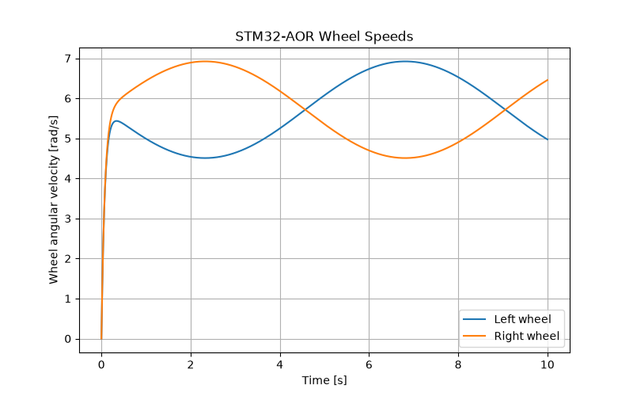

## AI Model

A realistic example of an AI agent running directly on a microcontroller is considered here.

**Application:** A two-wheel autonomous robot that moves through a room and avoids obstacles.

**Model:** A small fully connected neural network (MLP) that receives distance measurements and predicts the robot's desired motion.

A practical starting architecture is:

$$
\boxed{3 \rightarrow 8 \rightarrow 16 \rightarrow 2}
$$

- **3 inputs:** left, front, and right distance measurements
- **8 neurons:** first hidden layer
- **16 neurons:** second hidden layer
- **2 outputs:** desired linear velocity and desired angular velocity

{
  #fig-NNMLP
  fig-cap="The MLP neural network of the AI model"
  fig-alt="MLP neural network diagram"
}

This architecture shown in @fig-NNMLP is physically interpretable and suitable as a small embedded neural network.

The model is trained on a computer and can then be deployed to the STM32 using ST's AI deployment tools.

### Concrete Robot Definition

To generate a physically meaningful dataset, the robot must first be defined. The custom robot has the properties shown in @tbl-Parameters.


| Parameter                |                                                      Value |
| ------------------------ | ---------------------------------------------------------: |
| Drive type               |                                         Differential drive |
| Wheel separation \(L\)   |                                                     0.16 m |
| Wheel radius \(r\)       |                                                    0.032 m |
| Maximum wheel speed      |                                                   0.60 m/s |
| Maximum robot speed      |                                                   0.40 m/s |
| Maximum angular velocity |                                                  2.5 rad/s |
| Sensor range             |                                                0.05–2.00 m |
| Sensors                  |                                                3 × VL53L0X |
| Sensor directions        | Left \($−45^\circ$\), Front \($0^\circ$\), Right \($+45^\circ$\) |
: The parameters of a custom robot {#tbl-Parameters}


The three sensors measure the distances: $d_L,d_F,d_R$.

The neural network learns two physical control variables:

$$
[d_L,d_F,d_R]\rightarrow[v_d,\omega_d]
$$

where:

- $v_d$: desired linear velocity [m/s]
- $\omega_d$: desired angular velocity [rad/s]

This output representation is preferable because both variables have a direct **physical meaning**.

### Reference Obstacle-Avoidance Controller ###

First, a reference controller is created. This controller is **not an AI model**, it is defined using the control system theory.Here, It is used to generate physically meaningful **training labels** for the AI agent.

### Desired Linear Velocity


A relation between $d_f$ and $v_d$ should be considered practically.

1. Sensor Characteristics  
The lower threshold for $d_f$ is determined by the intrinsic measurement limitations of the front‑facing distance sensor. Many low‑cost ultrasonic and infrared sensors exhibit increased noise, reduced linearity, and diminished reliability at short ranges. Distances below approximately **0.2 m** fall within this region of degraded performance, making them unsuitable for stable control decisions. Consequently, the value of **0.2 m** is adopted as a conservative boundary that separates reliable measurements from those affected by sensor nonlinearity and saturation.

2. Robot Dynamics and Stopping Distance  
The upper threshold of **0.8 m** is selected based on the dynamic behavior of the robot, specifically its forward velocity, braking capability, and controller update rate. For a robot traveling at moderate speed, the combined stopping distance and reaction delay require that avoidance maneuvers begin well before an obstacle enters the critical zone. Empirical evaluation of the robot’s deceleration profile and control‑loop latency indicates that initiating avoidance when $d_f \le 0.8 \text{m}$ provides sufficient time to adjust heading or reduce velocity without inducing abrupt or unstable motion. Thus, the threshold reflects a safety margin derived from the robot’s physical constraints.
considering abovementioned points 1 and 2, we define:

$$
v_d =
\begin{cases}
0, & d_F \leq 0.2 \\
0.4\displaystyle\frac{d_F-0.2}{0.8-0.2},
& 0.2 < d_F < 0.8 \\
0.4, & d_F \geq 0.8
\end{cases}
$$

Thus:

- **Obstacle very close:** stop
- **Obstacle moderately close:** slow down
- **Obstacle far away:** move at up to 0.40 m/s

### Desired Angular Velocity

We can define the desired angular velocity from the difference between left and right distances: 


$$
e_d=d_L-d_R
$$

and

$$
\omega_d =
K_{\omega}
\frac{d_L-d_R}{d_L+d_R}
$$

with saturation:

$$
-2.5\leq\omega_d\leq2.5
$$

The sign convention is:

$$
\omega>0 \Rightarrow \text{turn left}
$$

$$
\omega<0 \Rightarrow \text{turn right}
$$

Therefore, if:

$$
d_R>d_L,
$$

then

$$
d_L-d_R<0
$$

and therefore:

$$
\omega_d<0.
$$

The robot turns right, toward the wider space.

For a first implementation, the simpler controller should be validated experimentally before adding additional terms.

### Front-Obstacle Consideration

Using only $d_L-d_R$ is not always sufficient when an obstacle is very close to the front of the robot.

For example:

$$
d_L=1.2\,m,\qquad
d_F=0.25\,m,\qquad
d_R=0.4\,m
$$

The front obstacle is close, so a stronger avoidance response may be required.

A more advanced reference controller could therefore use:

$$
\omega_d =
K_1\frac{d_L-d_R}{d_L+d_R}
+
K_2
\left(
\frac{1}{d_F}-\frac{1}{d_F^{ref}}
\right)
\operatorname{sign}(d_L-d_R)
$$

followed by saturation.

This increases the turning response as the front obstacle becomes closer. The additional controller terms should be parameterized and experimentally validated before they are used to generate the final dataset.

### Differential-Drive Kinematics

The desired robot motion must be converted into actual left- and right-wheel velocities.

For a differential-drive robot:

$$
v=\frac{v_R+v_L}{2}
$$

and

$$
\omega=\frac{v_R-v_L}{L}.
$$

Therefore:

$$
\boxed{
v_L=v_d-\frac{L}{2}\omega_d
}
$$

$$
\boxed{
v_R=v_d+\frac{L}{2}\omega_d
}
$$

With $L=0.16\,m$:

$$
\boxed{
v_L=v_d-0.08\omega_d
}
$$

$$
\boxed{
v_R=v_d+0.08\omega_d
}
$$

The wheel-speed limits are:

$$
-0.60\leq v_L,v_R\leq0.60\;m/s
$$

These constraints must be checked when generating the training labels.

### Example Training Sample

Suppose the sensors measure:

$$
d_L=0.80\,m,\qquad
d_F=1.20\,m,\qquad
d_R=1.20\,m
$$

Since the front is clear:

$$
v_d=0.40\,m/s
$$

and

$$
d_L-d_R=0.
$$

Therefore:

$$
\omega_d=0.
$$

The wheel velocities are:

$$
v_L=v_R=0.40\,m/s.
$$

The robot therefore moves straight.

### Training Dataset

The training data should be stored in a CSV file with the following columns:

```text
d_left_m,d_front_m,d_right_m,v_desired_mps,omega_desired_radps
```

The training dataset will be generated automatically from the validated reference controller by sampling a large number of physically feasible sensor states. Therefore, the dataset will represent realistic operating conditions rather than manually selected or arbitrary examples.

The generated data will initially be retained in floating-point form. Quantization, if required, will be performed as a subsequent model-deployment optimization on the trained neural network, rather than by arbitrarily converting the original physical training data to integer values.

## AI Model Architecture

The project is defined as:

$$
\boxed{
\text{VL53L0X}
\rightarrow
\text{MLP}
\rightarrow
(v_d,\omega_d)
\rightarrow
(v_L,v_R)
\rightarrow
\text{PWM}
\rightarrow
\text{motors}
}
$$

The MLP architecture is:

$$
\boxed{
\text{MLP}:3\rightarrow8\rightarrow16\rightarrow2
}
$$

with:

$$
\boxed{
\text{Input}=[d_L,d_F,d_R]\quad[m]
}
$$

and:

$$
\boxed{
\text{Output}=[v_d,\omega_d]\quad[m/s,\;rad/s]
}
$$

The wheel velocities are then calculated as:

$$
\boxed{
v_L=v_d-\frac{L}{2}\omega_d
}
$$

$$
\boxed{
v_R=v_d+\frac{L}{2}\omega_d
}
$$


### Project Workflow

1. **Define the robot**
   - STM32-based controller
   - Differential-drive system
   - Two DC motors
   - Wheel radius
   - Wheel separation
   - Maximum wheel speed

2. **Select the sensors**
   - $d_L,d_F,d_R$ from three VL53L0X ToF sensors

3. **Implement sensor acquisition**
   - STM32 I²C
   - Distance values in meters

4. **Implement motor control**
   - PWM
   - Differential-drive equations

5. **Define the physical robot model**
   - $v=(v_R+v_L)/2$
   - $\omega=(v_R-v_L)/L$

6. **Develop the reference obstacle-avoidance controller**
   - Produces physically meaningful $v_d,\omega_d$.

7. **Generate the training dataset**
   - $[d_L,d_F,d_R]\rightarrow[v_d,\omega_d]$
   - Floating-point data
   - Physically possible sensor states
   - Labels generated by the reference controller

8. **Train the MLP**
   - $3\rightarrow8\rightarrow16\rightarrow2$
   - FP32 training

9. **Validate the FP32 MLP**
   - Prediction error
   - Obstacle-avoidance behavior
   - Physical constraint checking

10. **Quantize the trained MLP**
    - Optional INT8 deployment optimization
    - Determine scales and zero-points using representative data

11. **Validate the quantized MLP**
    - Compare FP32 and INT8 outputs
    - Check whether quantization changes robot behavior significantly

12. **Deploy the MLP to the STM32**
    - Use the selected STM32 AI deployment tool
    - Generate optimized C code

13. **Integrate the MLP with FreeRTOS**
    - SensorTask
    - AITask
    - MotorTask
    - SafetyTask

14. **Run the real robot**

15. **Measure real-time performance**
    - Inference time
    - CPU utilization
    - RAM and Flash usage
    - Task execution time
    - Deadline misses
    - End-to-end latency

16. **Evaluate navigation performance**
    - Collision rate
    - Completion rate
    - Path efficiency
    - Average velocity
    - Energy consumption

### Overall Architecture

For the custom robot(there is no commercial name for it, we just call it STM32-AOR means Autonomous Obstacle Avoidance Robot), the MLP is integrated with FreeRTOS as a pipeline of periodic tasks. The "SafetyTask" has the highest priority.

The MLP should **not directly control the motors**. It produces desired motion commands, while the safety and motor-control layers determine whether and how those commands are applied.
The idea is shown in @fig-integration.

{
  #fig-integration
  fig-cap="Integration of FreeRTOS and the MLP"
  fig-alt="Integration of FreeRTOS and MLP"
  width=700px
}

### SensorTask

The SensorTask periodically reads the three VL53L0X sensors.

For example:

$$
T_S=20\,ms
$$

which corresponds to:

$$
f_S=50\,Hz.
$$

It reads $d_L,d_F,d_R$ and stores them in a shared sensor structure.

### AI Inference Task

The AITask reads the latest sensor vector:

$$
X=
\begin{bmatrix}
d_L\\
d_F\\
d_R
\end{bmatrix}
$$

and feeds it to:

$$
\boxed{
3\rightarrow8\rightarrow16\rightarrow2
}
$$

The MLP generates:

$$
Y=
\begin{bmatrix}
v_d\\
\omega_d
\end{bmatrix}.
$$

The outputs are constrained to:

$$
0\leq v_d\leq0.40\,m/s
$$

and

$$
-2.5\leq\omega_d\leq2.5\,rad/s.
$$

The AITask could initially run every:

$$
T_{AI}=20\,ms.
$$

This is a starting design value, not a measured requirement. The actual period should be selected after measuring the inference and system timing.

### SafetyTask

The SafetyTask independently checks the sensor data.

For example, if:

$$
d_F<0.10\,m,
$$

then:

$$
\boxed{
v_d=0,\qquad\omega_d=0
}
$$

regardless of the MLP output.

A simple three-level safety policy is:

- **Emergency:** $d_F<0.10\,m$ → immediate stop.
- **Danger:** $0.10\leq d_F<0.20\,m$ → force v_d=0.
- **Normal:** $d_F\geq0.20\,m$ → allow the AI command, subject to limits.

### MotorTask

The MotorTask converts $v_d,\omega_d$ into left- and right-wheel velocities.

For the differential-drive robot:

$$
v_L=v_d-\frac{L}{2}\omega_d
$$

$$
v_R=v_d+\frac{L}{2}\omega_d.
$$

With \(L=0.16\,m\):

$$
\boxed{
v_L=v_d-0.08\omega_d
}
$$

$$
\boxed{
v_R=v_d+0.08\omega_d
}
$$

The wheel velocities are then converted into motor commands.

A better implementation uses wheel encoders and closed-loop velocity control rather than mapping wheel velocity directly to PWM.

### FreeRTOS Task Priorities

The initial task priorities are shown in @tbl-tasks.

| Task | Period | Priority | Function |
|:--|--:|--:|:--|
| SafetyTask | 5 ms | **4** | Emergency and safety supervision |
| MotorTask | 5 ms | **3** | Wheel control and PWM |
| SensorTask | 20 ms | **2** | Read ToF sensors |
| AITask | 20 ms | **2** | MLP inference |

: Initial FreeRTOS task schedule {#tbl-tasks}

The exact priorities should eventually be determined from measured execution times and timing requirements rather than assumed in advance. The initial priority hierarchy is:

$$
\boxed{
\text{Safety}>\text{Motor}>\text{AI/Sensor}
}
$$

An AI inference task should never prevent an emergency stop.

## Agent

The agent is the complete autonomous robot system. The RTOS coordinates the tasks, while the AI model helps determine the robot's action.

::: {.text-center}
**Agent**

STM32 + RTOS + Sensors + AI + Motor Control

SensorTask $\rightarrow$ AITask $\rightarrow$ SafetyTask $\rightarrow$ MotorTask
:::

### Complete Interaction Loop

In the state space of the robot system at point x, there is a state of S. This states integrally demonstrate the behavior of the robot usually can be seen in the trajectory of a system. To control the custom robot to avoid the obstacles smoothly, safely and swiftly, the actions of the AI agent is something like the inputs for the control  system. The observable states read from the sensor and help us to find the states of desired speed and desired angular velocity as the $a(t)$ or action at the moment $t$ and as the distances are our known states at this moment, this understandings from the agent and environment leads to find the the states of the system at the next moment.  

Mathematically:

- **AI model:** $s_t\rightarrow a_t$
- **Environment:**
$(s_t,a_t) \rightarrow s_{t+1} : s_{t+1} =f_{environment}(s_t, a_t)$

where:

- $s_t$: current sensor state
- $a_t$: robot action
- $s_{t+1}$: new sensor state

@fig-loop shows this procdure from the AI model from view of an external observer. 

{
  #fig-loop
  fig-cap="The complete interaction loop"
  fig-alt="Interaction loop"
  width=600px
}


The steering command $u_s$ is in [-1,1] so that the steering-wheel can be turned to the right at the interval [0,1] and to the left at the interval [-1,0]. for instant, if the steering command is $-0.86$ that means the steering-wheel $-0.86\pi (Rad)$ is rotated to the left.-negative sign of $u_s$ means turn to the left-
Besides, desired speed($u_v$) produced by the neural network is in [0,1]. For instance, if it is $0.6$ the desired speed command is $0.6$ m/sec and the value is $60\%$ of the maximum speed.

For example:
$$
[0.4,\ 0.125,\ 0.5]^T
\rightarrow
the\ output\ is\ [+0.7,\ 0.20]
\rightarrow
[0.60,\ 0.35,\ 0.95]
$$
here: $$
y=[u_s,u_v]^T
$$
The steering output has been changed. The robot changes its motion, so the next sensor measurements are different.
The motor commands would be: $u_s= +0.7 , u_v=0.25$, as $v_l=u_v(1+u_s)$ and $v_r=u_v(1-u_s)$ $\rightarrowtail$ $v_l=0.425,v_r=0.075$ $\rightarrowtail$  left motor 42.5% and right motor 7.5% is on and the robot turns right. It means the push on the right wheel is less.

### Sensor Quantization Example

Suppose the robot has three distance measurements:

- Left = 80 cm
- Front = 25 cm
- Right = 100 cm

If a fixed scaling factor of 200 is used for an embedded representation:

$$
x=
\begin{bmatrix}
80/200\\
25/200\\
100/200
\end{bmatrix}
=
\begin{bmatrix}
0.40\\
0.125\\
0.50
\end{bmatrix}
$$

This is a **scaling/normalization step**, not INT8 neural-network quantization.

The physical sensor values are first converted into the representation expected by the trained model. If INT8 quantization is used, the neural-network input is subsequently mapped using the quantizer's scale and zero-point.

The model then produces:

$$
y=
\begin{bmatrix}
v_d\\
\omega_d
\end{bmatrix}
$$

The robot does not directly send these two values to the motors. The control software applies safety checks, converts them to wheel velocities, and then generates the motor commands.

## Environment

The neural network is the decision-making model; the agent is the complete robot system that uses the model.

The **environment** is the physical world surrounding the robot. In this specific AI model, the environment includes:

- Walls
- Tables
- Chairs
- People
- Other obstacles
- Floor surface
- Battery and motor conditions

The environment changes when the robot moves.

{
  #fig-robot
  fig-cap="A two-wheel autonomous robot"
  fig-alt="Two-wheel autonomous robot"
}

For example:

**The robot moves forward → approaches a wall → the distance sensors measure a smaller distance → the robot changes its action.**

## Neural Network for the Robot ##

### Input layer — 3 neurons
The three inputs come from the three VL53L0X distance sensors:
$$
\mathbf{x} = \begin{bmatrix} d_L\\ d_F\\ d_R \end{bmatrix}
$$
where:
$d_L$: left distance
$d_F$: front distance
$d_R$: right distance
The units should be meters. For example: $d_L = 0.80$ m, $d_F = 0.45$ m, $d_R = 1.20$ m. The input vector is therefore $x=[0.80,0.45,1.20]$.

### Normalization ###
Before feeding the values into the neural network, It is better to scale them, Because your sensor range is approximately:
$$
0.05 \le d \le 2.00\;m
$$
you could use:
$$
d_{norm} = \frac{d-d_{min}}{d_{max}-d_{min}}
$$
giving approximately:
$$
0\le d_{norm}\le1
$$

### First hidden layer ###

The first hidden layer contains 8 neurons. Mathematically:
$$
\mathbf{h}_1 = ReLU(W_1\mathbf{x}+\mathbf{b}_1)
$$
where: 
$$
W_1\in\mathbb{R}^{8\times3}
$$
and
$$
\mathbf{b}_1\in\mathbb{R}^{8}
$$
Therefore, this layer receives 3 values and produces 8 features.

### Activation function ###

For the hidden layers, it is chosen as:
$$
ReLU(x)=\max(0,x)
$$
For example:
$$
[-0.4,\;0.2,\;-0.1,\;0.8]
$$
becomes:
$$
[0,\;0.2,\;0,\;0.8]
$$
ReLU is particularly convenient for STM32 deployment because it is computationally inexpensive.

### Second Layer ###
The second layer can combine the simpler features learned by the first layer into more complex decision patterns.
The entire neural network contains only 210 trainable parameters, That's extremely small for an STM32.
If you deploy the network using FP32:
$$
210\times4=840\text{ bytes}
$$
So the weights and biases require only about: $\boxed{0.82 KiB}$
	

### Number of neurons ###

The network needs to learn relationships such as:
Is there an obstacle directly ahead?
Is the left side more open than the right?
Is the robot approaching an obstacle?
Is the robot in a corridor?
Is there sufficient free space for forward motion?
Should the robot turn left or right?

Eight neurons provide enough capacity to learn these relatively simple spatial relationships without making the network unnecessarily large.
The Neural Network do not learn like this, "If front distance is 0.3 m, turn right." Neural Network learn to imitate the behavior of the reference controller. An example of the lables given in @tbl-lables.
$$
f:(d_L​,d_F​,d_R​)→(vd​,ωd​)
$$
for example:

| $d_L$ | $d_F$| $d_R$ | $v_d$ | $\omega_d$ |
| ------: | ------: | ------: | ------: | -----------: |
|    1.20 |    1.00 |    0.50 |    0.40 |        +0.80 |
|    0.50 |    1.00 |    1.20 |    0.40 |        −0.80 |
|    0.80 |    0.30 |    0.80 |   0.067 |            0 |
|    0.30 |    0.15 |    1.00 |       0 |         −1.5 |
: Choosing the lables for NN. {#tbl-lables}

These labels should come from your reference navigation controller, rather than arbitrary manually selected values. MLP $≈$ Reference Controller. This is essentially **supervised learning / imitation learning**.

### The Output Layer ###

The final layer has two outputs:
y=$[v_d,\omega_d]^T$,
It has two neurons.It is recommended no ReLU on the output layer, because: $v_d$ should normally be non-negative but can be limited separately.
$\omega_d$ must be able to be positive or negative.
Using your convention:
$$
\omega_d>0\Rightarrow\text{turn left}
$$
$$
\omega_d<0\Rightarrow\text{turn right}
$$
compactly
$$
\boxed y=W_3​ReLU(W_2​ReLU(W_1​\boxed x+b_1)+b_2​)+b_3​ 
$$

In @fig-stm32 the different tasks in the AI agent architecture are performing scheduled by the FreeRTOS of the microconroller. The task duration has been specified for each task.

{
  #fig-stm32
  fig-cap="MLP inside FreeRTOS"
  fig-alt="inside the stm32"
  width=600px
}


# Mathematical model of STM32-AOR #

The robot has a dynamical kinematical model. At first, the dynamics of the differential-drive model should be obtained. Thereafter, considering the wheel speed, we try to find the kinematic model. As you know, there is a Neural Network controller from the sensor to the state of angular velocity and linear speed inside the safety task which prepare the commands for the motor. 
Additionally I decided to exploit commercial models which they are available in the market. It can be assembled in the laboratory with the required components in the @tbl-comp.


| Row | Hardware | Exact Model / Specification | Role in STM32-AOR |
|:---:|:---|:---|:---|
| 1 | **Microcontroller** | **STM32F407VGT6** | Runs FreeRTOS, the MLP controller, safety logic, and motor control |
| 2 | **Drive Motor ×2** | **Pololu Romi 120:1 HP Gearmotor with Encoder** | Provides differential-drive propulsion |
| 3 | **Wheel Encoder ×2** | **Quadrature encoders integrated with Romi motors** | Provides wheel-speed and odometry feedback |
| 4 | **Distance Sensor ×3** | **VL53L0X ToF sensor** | Measures left, front, and right distances |
| 5 | **Robot Chassis** | **Pololu Romi Chassis / Platform** | Provides the mechanical platform for the robot |
| 6 | **Motor Driver** | **Dual H-bridge motor driver** | Drives the left and right motors using STM32 PWM |
| 7 | **Battery** | **Li-ion/LiPo battery pack** | Provides the main robot power source |
| 8 | **Voltage Regulator** | **DC-DC voltage regulator** | Provides the required regulated power rails |
| 9 | **Programmer/Debugger** | **ST-LINK** | Provides STM32 programming and debugging |
| 10 | **PWM Interface** | **STM32 Timer PWM** | Controls motor speed |
| 11 | **Encoder Interface** | **STM32 Timer Encoder Mode** | Reads quadrature encoder signals |
| 12 | **Sensor Interface** | **I²C** | Communicates with the three VL53L0X sensors |
| 13 | **Safety Interface** | **GPIO / Motor Enable** | Provides motor shutdown and safety control |
| 14 | **Communication Interface** | **USART / USB** | Supports debugging, telemetry, and experiment logging |

: The hardware selection is based on the Pololu Romi platform, which is a small differential-drive robot chassis with integrated motors and encoders. The VL53L0X sensors are used for distance measurements to detect obstacles and navigate the environment. The STM32F407VGT6 microcontroller runs the FreeRTOS operating system, which manages tasks such as sensor reading, MLP control, safety logic, and motor control.  {#tbl-comp}


The commercial name of this robot is "Pololu Romi". Your robot is a **differential-drive mobile robot** with:

* Two driven wheels
* Wheel diameter = 70 mm
* Wheel radius:

$$
r=0.035\;m
$$

* Track width:

$$
L=0.141\;m
$$

* Three VL53L0X sensors:

$$
(d_L,d_F,d_R)
$$

* MLP controller ##:

$$
f:(d_L,d_F,d_R)\rightarrow(v_d,\omega_d)
$$

with architecture:

$$
\boxed{3-8-16-2}
$$

The mathematical model can be separated into four parts:

$$
\boxed{
\text{Sensors}
\rightarrow
\text{MLP}
\rightarrow
\text{Wheel Dynamics}
\rightarrow
\text{Robot Kinematics}
}
$$

## MLP controller ##

The neural network receives the distances from the three VL53L0X sensors:

$$
\mathbf{s}=
\begin{bmatrix}
d_L\\d_F\\d_R
\end{bmatrix}
$$

and produces the desired linear and angular velocities:

$$
\mathbf{u}_d=
\begin{bmatrix}
v_d\\
\omega_d
\end{bmatrix}
$$

Conceptually the output is a function of the input:

$$
\mathbf{u}_d=f_{\text{MLP}}(\mathbf{s})
$$

The actual trained weights from the reference controller performance can later be inserted into the Python model.

---

## Differential-drive model ##

The relationship between robot velocity and wheel velocities is:
0
$$
v=\frac{r}{2}(\omega_R+\omega_L)
$$

and

$$
\omega=\frac{r}{L}(\omega_R-\omega_L)
$$

where:
$$
* v: robot linear velocity
* \omega: robot angular velocity
* \omega_R: right-wheel angular velocity
* \omega_L: left-wheel angular velocity
$$

The inverse equations are:

$$
\boxed{
\omega_R=
\frac{v+\frac{L}{2}\omega}{r}
}
$$

$$
\boxed{
\omega_L=
\frac{v-\frac{L}{2}\omega}{r}
}
$$

Therefore, your MLP outputs $v_d,\omega_d$, which are converted into desired wheel speeds.

---

## Wheel dynamics ##

For the first deterministic simulation model, A first-order approximation can be used to get the kinematics of the robot. The first-order dynamics of the wheels can be modeled as:

$$
\tau_m\dot{\omega}_R+\omega_R=\omega_{R,d}
$$

$$
\tau_m\dot{\omega}_L+\omega_L=\omega_{L,d}
$$

with $\tau_m=0.08\,s$.

This gives a simple but useful model of the motor/gearbox response.

---

## Robot's position dynamics ##

The robot states are defined as:

$$
\mathbf{x}=
\begin{bmatrix}
x\\y\\\theta
\end{bmatrix}
$$

and

$$
\boxed{
\dot{x}=v\cos\theta
}
$$

$$
\boxed{
\dot{y}=v\sin\theta
}
$$

$$
\boxed{
\dot{\theta}=\omega
}
$$

Thus the complete kinematical dynamical model would be:

$$
\boxed{
\begin{aligned}
\tau_m\dot{\omega}_R+\omega_R&=\omega_{R,d}\\
\tau_m\dot{\omega}_L+\omega_L&=\omega_{L,d}\\
v&=\frac{r}{2}(\omega_R+\omega_L)\\
\omega&=\frac{r}{L}(\omega_R-\omega_L)\\
\dot{x}&=v\cos\theta\\
\dot{y}&=v\sin\theta\\
\dot{\theta}&=\omega
\end{aligned}}
$$

This is the **determined mathematical robot model**, recommended to use as the foundation for the STM32-AOR project.

---

# Python implementation #

Here is the complete Python implementation used to generate the trajectory of the robot, the linear and angular velocities, and the wheel speeds. The code is written in a single file for simplicity, but it can be modularized later.

```python
import numpy as np
import matplotlib.pyplot as plt

Robot geometry and simulation parameters
r = 0.035
L = 0.141
dt = 0.01
T = 10.0
t = np.arange(0, T + dt, dt)

Desired commands from the 3-8-16-2 MLP
v_d = 0.20 * np.ones_like(t)
omega_d = 0.60 * np.sin(0.7 * t)

Inverse differential-drive kinematics
omega_R_d = (v_d + 0.5 * L * omega_d) / r
omega_L_d = (v_d - 0.5 * L * omega_d) / r

First-order wheel dynamics
tau_m = 0.08

omega_R = np.zeros_like(t)
omega_L = np.zeros_like(t)

Euler integration
for k in range(len(t) - 1):
    omega_R[k + 1] = omega_R[k] + \
        dt / tau_m * (omega_R_d[k] - omega_R[k])

    omega_L[k + 1] = omega_L[k] + \
        dt / tau_m * (omega_L_d[k] - omega_L[k])

Forward differential-drive kinematics
v = 0.5 * r * (omega_R + omega_L)
omega = r / L * (omega_R - omega_L)

Robot pose
x = np.zeros_like(t)
y = np.zeros_like(t)
theta = np.zeros_like(t)

Integrate robot pose
for k in range(len(t) - 1):
    theta[k + 1] = theta[k] + dt * omega[k]

    x[k + 1] = x[k] + \
        dt * v[k] * np.cos(theta[k])

    y[k + 1] = y[k] + \
        dt * v[k] * np.sin(theta[k])

Plot robot trajectory
plt.figure(figsize=(8, 5))
plt.plot(x, y)
plt.xlabel("x [m]")
plt.ylabel("y [m]")
plt.title("STM32-AOR Robot Trajectory")
plt.grid(True)
plt.axis("equal")
plt.show()

Plot linear velocity
plt.figure(figsize=(8, 5))
plt.plot(t, v, label="Actual v")
plt.plot(t, v_d, "--", label="Desired vd")
plt.xlabel("Time [s]")
plt.ylabel("Linear velocity [m/s]")
plt.title("STM32-AOR Linear Velocity")
plt.legend()
plt.grid(True)
plt.show()

Plot angular velocity
plt.figure(figsize=(8, 5))
plt.plot(t, omega, label="Actual ω")
plt.plot(t, omega_d, "--", label="Desired ωd")
plt.xlabel("Time [s]")
plt.ylabel("Angular velocity [rad/s]")
plt.title("STM32-AOR Angular Velocity")
plt.legend()
plt.grid(True)
plt.show()

Plot wheel velocities
plt.figure(figsize=(8, 5))
plt.plot(t, omega_L, label="Left wheel")
plt.plot(t, omega_R, label="Right wheel")
plt.xlabel("Time [s]")
plt.ylabel("Wheel angular velocity [rad/s]")
plt.title("STM32-AOR Wheel Speeds")
plt.legend()
plt.grid(True)
plt.show()
```

## Explanation of every line ##

Import libraries

```python
import numpy as np
```

Imports NumPy for numerical calculations, arrays, and mathematical functions.

```python
import matplotlib.pyplot as plt
```

Imports Matplotlib for drawing the simulation outputs.

---

### Robot parameters

```python
r = 0.035
```

Sets the wheel radius to 35 mm:

$$
r=0.035\,m
$$

because your Romi wheels are 70 mm in diameter.

```python
L = 0.141
```

Sets the distance between the left and right wheel contact lines to approximately 141 mm.

```python
dt = 0.01
```

Sets the simulation sampling time:

$$
dt=10\,ms
$$

```python
T = 10.0
```

The simulation runs for 10 seconds.

```python
t = np.arange(0, T + dt, dt)
```

Creates the simulation time vector:

$$
0,0.01,0.02,\ldots,10
$$

---

MLP output

```python
v_d = 0.20 * np.ones_like(t)
```

Creates the desired linear velocity:

$$
v_d=0.20\,m/s
$$

For this demonstration it is constant. In the real STM32-AOR system, this value will come from your MLP network.

```python
omega_d = 0.60 * np.sin(0.7 * t)
```

Creates a changing desired angular velocity:

$$
\omega_d(t)=0.6\sin(0.7t)
$$

This is only a test signal to demonstrate turning.

Later we replace these two lines with:

$$
(v_d,\omega_d)
=
f_{\text{MLP}}(d_L,d_F,d_R)
$$

---

**Convert robot commands to wheel commands**

The desired wheel angular velocities for the left and right wheels are calculated from the desired linear and angular velocities of the robot. 

```python
omega_R_d = (v_d + 0.5 * L * omega_d) / r
```

Implements

$$
\omega_{R,d}
=
\frac{v_d+\frac{L}{2}\omega_d}{r}
$$

This calculates the required right-wheel angular velocity.

```python
omega_L_d = (v_d - 0.5 * L * omega_d) / r
```

$$
\omega_{L,d}
=
\frac{v_d-\frac{L}{2}\omega_d}{r}
$$

This calculates the required left-wheel angular velocity.

Notice something important:

* When $\omega_d>0$, the right wheel becomes faster.
* The left wheel becomes slower.
* Therefore the robot turns to the left.

---

Motor dynamics

```python
tau_m = 0.08
```

The motor/wheel time constant should be defined. This is a first-order approximation of the motor/gearbox dynamics.

$$
\tau_m=80\,ms
$$

```python
omega_R = np.zeros_like(t)
```

Creates an array containing the actual right-wheel speed.

Initially:

$$
\omega_R(0)=0
$$

```python
omega_L = np.zeros_like(t)
```

Creates the actual left-wheel speed array.

Again:

$$
\omega_L(0)=0
$$

---

**Numerical solution**

```python
for k in range(len(t) - 1):
```

Starts a loop through all simulation time steps.

```python
omega_R[k + 1] = omega_R[k] + \
    dt / tau_m * (omega_R_d[k] - omega_R[k])
```

This is the discrete version of using Euler integration.

$$
\tau_m\dot{\omega}_R
=
\omega_{R,d}-\omega_R
$$

The difference $\omega_{R,d}-\omega_R$ is the wheel-speed error.

```python
omega_L[k + 1] = omega_L[k] + \
    dt / tau_m * (omega_L_d[k] - omega_L[k])
```

Does exactly the same thing for the left wheel.

---

Calculate actual robot velocity

```python
v = 0.5 * r * (omega_R + omega_L)
```

$$
v=\frac{r}{2}(\omega_R+\omega_L)
$$

This converts wheel angular velocities into robot linear velocity.

```python
omega = r / L * (omega_R - omega_L)
```

$$
\omega=\frac{r}{L}(\omega_R-\omega_L)
$$

This calculates the robot's angular velocity.

---

Robot position

```python
x = np.zeros_like(t)
```

Creates the $x$-position array.

```python
y = np.zeros_like(t)
```

Creates the $y$ -position array.

```python
theta = np.zeros_like(t)
```

Creates the robot orientation array.

Initially:

$$
x(0)=0,\qquad y(0)=0,\qquad\theta(0)=0
$$

---

**Integrate the robot equations**

```python
for k in range(len(t) - 1):
```

Again moves through the simulation time steps.

```python
theta[k + 1] = theta[k] + dt * omega[k]
```

implements the discrete version of:
$$
\dot{\theta}=\omega
$$

using Euler integration.

```python
x[k + 1] = x[k] + dt * v[k] * np.cos(theta[k])
```
implements:
$$
\dot{x}=v\cos\theta
$$

```python
y[k + 1] = y[k] + dt * v[k] * np.sin(theta[k])
```

Implements

$$
\dot{y}=v\sin\theta
$$

Together, these three equations determine the robot's trajectory.

---

Outputs

The first plot is:

$$
\boxed{x(t),y(t)}
$$

which shows the **robot trajectory** in @fig-traj.

{
  #fig-traj
  fig-cap=""
  fig-alt="robot trajectory"
}

The second shown in @fig-vel compares:

$$
\boxed{v(t)\quad\text{vs.}\quad v_d(t)}
$$

{
  #fig-vel
  fig-cap=""
  fig-alt="linear velocity comparison"
}

The third curve shown in @fig-omega compares:

$$
\boxed{\omega(t)\quad\text{vs.}\quad\omega_d(t)}
$$

{
  #fig-omega
  fig-cap=""
  fig-alt="angular velocities comparison"
}

And the fourth drawn in @fig-rlomega shows:

$$
\boxed{\omega_L(t),\omega_R(t)}
$$

{
  #fig-rlomega
  fig-cap=""
  fig-alt="Right and left wheel angular velocities"
}

These are exactly the kinds of outputs we need later for evaluating the STM32-AOR controller.


## The Next step ##

This model is intentionally the **first deterministic baseline**. The next version should make it substantially more realistic by replacing the artificial test signals.

$$
v_d=0.2
$$

and

$$
\omega_d=0.6\sin(0.7t)
$$

should be replacedwith the actual **3-8-16-2 MLP**:

$$
\boxed{
[d_L,d_F,d_R]
\rightarrow
\text{MLP}_{3-8-16-2}
\rightarrow
[v_d,\omega_d]
}
$$

and then introduce the VL53L0X sensor measurements, obstacle/environment model, motor parameters, encoder feedback, SafetyTask, and FreeRTOS timing.

That will give us a complete simulation chain corresponding much more closely to your actual STM32-AOR implementation:

$$
\boxed{
\text{Environment}
\rightarrow
\text{VL53L0X}
\rightarrow
\text{SensorTask}
\rightarrow
\text{MLP}
\rightarrow
\text{SafetyTask}
\rightarrow
\text{MotorTask}
\rightarrow
\text{Romi}
}
$$

It is remembered this mathematical model and Python simulation as the current STM32-AOR baseline, so we can build the MLP/environment/dynamics model on top of it rather than starting again.


## Reference controller for STM32-AOR ##

For the Romi robot, I suggest a distance-based reactive obstacle-avoidance controller with two components:

**Speed controller** → determines $v_d$ from front distance.

**Steering controller** → determines $\omega_d$ from left or right free space, with stronger steering when the front obstacle is close.

The controller does not need to know the robot's $x,y,\theta$. It only needs the three virtual or real sensor measurements:

$$ \mathbf d = \begin{bmatrix} d_L & d_F & d_R \end{bmatrix} $$

**Speed reference**

to control the the desired speed, 3 scenarios should be given:

far from obstacle → move at maximum speed

approaching obstacle → slow down

obstacle very close → stop

Define

$$ v_d = v_{\max} \operatorname{sat} \left( \frac{d_F-d_{\text{stop}}} {d_{\text{slow}}-d_{\text{stop}}} \right) $$

where

$$ \operatorname{sat}(x)= \begin{cases} 0 & x<0\\ x & 0\leq x\leq1\\ 1 & x>1 \end{cases} $$

For our current model, we can choose:

$$ v_{\max}=0.40\ {\rm m/s} $$ $$ d_{\text{stop}}=0.15\ {\rm m} $$ $$ d_{\text{slow}}=1.05\ {\rm m} $$

Therefore:

$$ \boxed{ v_d=0.40 \operatorname{sat} \left( \frac{d_F-0.15}{0.90} \right) } $$

This actually reproduces two of your existing labels very closely.

For example:

Example 1
$$ d_F=1.00 $$

gives

$$ v_d=0.40\frac{1.00-0.15}{0.90} =0.3778 $$

This is not exactly your \(0.40\), so for the training-label generator I would actually use a two-region speed law:

$$ v_d = \begin{cases} 0, & d_F\leq0.15\\[2mm] 0.40\frac{d_F-0.15}{0.90}, &0.15<d_F<1.05\\[2mm] 0.40,&d_F\geq1.05 \end{cases} $$

This gives approximately

$$ d_F=0.30 \Rightarrow v_d=0.0667 $$

and

$$ d_F=0.15 \Rightarrow v_d=0. $$

**The steering behavior**

We want the robot to turn toward the side with more free space.

Define the left orright error:

$$ e=d_L-d_R $$

Then use proportional steering:

$$ \omega_d=K_\omega e $$

with saturation:

$$ \boxed{ \omega_d= \operatorname{sat} \left[ K_\omega*e, -\omega_{\max},+\omega_{\max} \right] } $$

For example:

$$ K_\omega=2 $$

and

$$ \omega_{\max}=1.5\ {\rm rad/s}. $$

Therefore:


$d_R>d_L → \omega_d>0$ → turn left

$d_L>d_R → \omega_d<0$ → turn right

$d_L=d_R → \omega_d=0$ → go straight


# Design AI Agent for Robot in Python #
The first step in designing an AI agent for a robot is to define the agent's architecture and capabilities. This involves determining the types of sensors and actuators the robot will use, as well as the algorithms that will govern its behavior. 
The first AI agent we will design is a simple reactive agent that uses sensor data to make decisions in real-time. The agent will be able to navigate through an environment, avoid obstacles, and reach a target location.
The artificial intelligence agent will be implemented in Python, leveraging libraries such as NumPy for numerical computations and sci-kit-learn for machine learning tasks. The agent will be structured to process sensor inputs, make decisions based on those inputs, and control the robot's actuators accordingly.


---
title: "MLP Obstacle Avoidance Controller Approximation"
format: html
jupyter: python3
---


## Imports

```{python}
import numpy as np
import matplotlib.pyplot as plt

from sklearn.model_selection import train_test_split
from sklearn.preprocessing import StandardScaler
from sklearn.neural_network import MLPRegressor
from sklearn.metrics import mean_squared_error, mean_absolute_error, r2_score
```

## Generate Training Data from the Reference Controller

```{python}
def reference_controller(dL, dF, dR):
    """
    Reference obstacle-avoidance controller.

    Inputs:
        dL : left distance  [m]
        dF : front distance [m]
        dR : right distance [m]

    Outputs:
        vd       : desired linear velocity [m/s]
        omega_d  : desired angular velocity [rad/s]
    """

    # Controller parameters
    v_max = 0.40
    omega_max = 1.50

    # Safety distances
    d_stop = 0.15
    d_slow = 0.50

    # Emergency stop
    if dF < d_stop:
        vd = 0.0

        if dL > dR:
            omega_d = +omega_max
        else:
            omega_d = -omega_max

        return vd, omega_d

    # Front obstacle
    if dF < d_slow:

        if dL > dR:
            omega_d = +omega_max
        else:
            omega_d = -omega_max

        vd = v_max * (dF - d_stop) / (d_slow - d_stop)
        vd = np.clip(vd, 0.0, v_max)

        return vd, omega_d

    # Normal navigation
    wall_error = dL - dR

    K_omega = 2.0

    omega_d = K_omega * wall_error
    omega_d = np.clip(
        omega_d,
        -omega_max,
        +omega_max
    )

    closest_side = min(dL, dR)

    if closest_side < d_slow:
        speed_factor = (
            closest_side - d_stop
        ) / (d_slow - d_stop)

        speed_factor = np.clip(
            speed_factor,
            0.0,
            1.0
        )
    else:
        speed_factor = 1.0

    vd = v_max * speed_factor

    return vd, omega_d
```

## Generate Samples ##

```{python}
np.random.seed(42)

N = 10000

# Sensor ranges [m]
dL = np.random.uniform(0.10, 2.00, N)
dF = np.random.uniform(0.10, 2.00, N)
dR = np.random.uniform(0.10, 2.00, N)

X = np.column_stack((dL, dF, dR))

Y = np.zeros((N, 2))

for i in range(N):
    Y[i, 0], Y[i, 1] = reference_controller(
        dL[i],
        dF[i],
        dR[i]
    )

print("Dataset shape:")
print("X:", X.shape)
print("Y:", Y.shape)
```

## Split Training and Testing Data ##

```{python}
X_train, X_test, Y_train, Y_test = train_test_split(
    X,
    Y,
    test_size=0.20,
    random_state=42
)
```

## Normalize Inputs ##

```{python}
input_scaler = StandardScaler()

X_train_scaled = input_scaler.fit_transform(X_train)
X_test_scaled = input_scaler.transform(X_test)
```

## Normalize Outputs ##

```{python}
output_scaler = StandardScaler()

Y_train_scaled = output_scaler.fit_transform(Y_train)
Y_test_scaled = output_scaler.transform(Y_test)
```

## Create 3 → 8 → 16 → 2 MLP ##

```{python}
mlp = MLPRegressor(
    hidden_layer_sizes=(8, 16),
    activation="relu",
    solver="adam",
    learning_rate_init=0.001,
    max_iter=2000,
    batch_size=64,
    random_state=42,
    early_stopping=True,
    validation_fraction=0.15,
    n_iter_no_change=30,
    verbose=False
)

mlp
```

## Train the Network ##

```{python}
mlp.fit(
    X_train_scaled,
    Y_train_scaled
)
```

```{python}
#| echo: false
# ---------------------------------------------------------
# Display only selected training iterations
# ---------------------------------------------------------

loss_curve = mlp.loss_curve_
n_iterations = len(loss_curve)

# Number of iterations to show at the beginning and end
n_show = 5

print("==============================")
print("SELECTED TRAINING ITERATIONS")
print("==============================")

print("\nFirst iterations:")

for i in range(min(n_show, n_iterations)):
    print(
        f"Iteration {i + 1:4d} : "
        f"Loss = {loss_curve[i]:.6f}"
    )

print("\n...")

print("\nLast iterations:")

start = max(n_iterations - n_show, n_show)

for i in range(start, n_iterations):
    print(
        f"Iteration {i + 1:4d} : "
        f"Loss = {loss_curve[i]:.6f}"
    )

print("\nTotal iterations:", n_iterations)

```


## Predict ##

```{python}
Y_pred_scaled = mlp.predict(X_test_scaled)

Y_pred = output_scaler.inverse_transform(
    Y_pred_scaled
)
```

## Evaluate the Network ##

```{python}
mse = mean_squared_error(
    Y_test,
    Y_pred
)

mae = mean_absolute_error(
    Y_test,
    Y_pred
)

r2 = r2_score(
    Y_test,
    Y_pred
)

print("==============================")
print("MLP PERFORMANCE")
print("==============================")

print(f"MSE : {mse:.6f}")
print(f"MAE : {mae:.6f}")
print(f"R²  : {r2:.6f}")

print("\nNumber of training iterations:")
print(mlp.n_iter_)
```

## Display Network Dimensions ##

```{python}
print("==============================")
print("NETWORK ARCHITECTURE")
print("==============================")

print("Input layer  : 3 neurons")
print("Hidden layer : 8 neurons")
print("Hidden layer : 16 neurons")
print("Output layer : 2 neurons")

print("\nWeight matrix dimensions:")

for i, W in enumerate(mlp.coefs_):
    print(f"W{i+1}: {W.shape}")

print("\nBias dimensions:")

for i, b in enumerate(mlp.intercepts_):
    print(f"b{i+1}: {b.shape}")
```


## Save the trained MLP ##


```{python}
np.savez(
    "trained_mlp.npz",

    # MLP weights
    W1=mlp.coefs_[0],
    W2=mlp.coefs_[1],
    W3=mlp.coefs_[2],

    # MLP biases
    b1=mlp.intercepts_[0],
    b2=mlp.intercepts_[1],
    b3=mlp.intercepts_[2],

    # Input normalization
    X_mean=input_scaler.mean_,
    X_scale=input_scaler.scale_,

    # Output normalization
    Y_mean=output_scaler.mean_,
    Y_scale=output_scaler.scale_
)

print("==============================")
print("MLP MODEL SAVED")
print("==============================")
print("File: trained_mlp.npz")
```


**Example Prediction**

```{python}
example = np.array([
    [1.20, 1.00, 0.50]
])

example_scaled = input_scaler.transform(example)

prediction_scaled = mlp.predict(
    example_scaled
)

prediction = output_scaler.inverse_transform(
    prediction_scaled
)

print("==============================")
print("EXAMPLE")
print("==============================")

print("Input:")
print("dL = 1.20 m")
print("dF = 1.00 m")
print("dR = 0.50 m")

print("\nMLP output:")
print(f"vd      = {prediction[0, 0]:.4f} m/s")
print(f"omega_d = {prediction[0, 1]:.4f} rad/s")
```


## Plot Training Loss ##

```{python}
plt.figure(figsize=(8, 5))

plt.plot(
    mlp.loss_curve_
)

plt.xlabel("Iteration")
plt.ylabel("Loss")
plt.title("3 → 8 → 16 → 2 MLP Training Loss")

plt.grid(True)
plt.tight_layout()
plt.show()
```


## Compare Reference Controller and MLP ##

**Linear Velocity**

```{python}
plt.figure(figsize=(8, 5))

plt.scatter(
    Y_test[:, 0],
    Y_pred[:, 0],
    s=8,
    alpha=0.5
)

plt.xlabel("Reference vd [m/s]")
plt.ylabel("MLP vd [m/s]")
plt.title("Linear Velocity: Reference vs MLP")

plt.grid(True)
plt.tight_layout()
plt.show()
```

**Angular Velocity

```{python}
plt.figure(figsize=(8, 5))

plt.scatter(
    Y_test[:, 1],
    Y_pred[:, 1],
    s=8,
    alpha=0.5
)

plt.xlabel("Reference omega [rad/s]")
plt.ylabel("MLP omega [rad/s]")
plt.title("Angular Velocity: Reference vs MLP")

plt.grid(True)
plt.tight_layout()
plt.show()
```


# Romi Robot Simulation with the Trained MLP

## Objective ##

The objective is to model the Romi robot using the **actual trained 3→8→16→2 MLP** and observe its autonomous movement in a two-dimensional environment containing obstacles. It is the simulation of the actual Romi robot performance with all the hardware plus its MLP Controller.

The MLP receives the three distance measurements

$$
(d_L,d_F,d_R)
$$

and produces the desired linear and angular velocities

$$
(v_d,\omega_d).
$$

The complete closed-loop model is:

$$
\boxed{
\text{Environment}
\rightarrow
\text{Virtual Sensors}
\rightarrow
\text{MLP}
\rightarrow
(v_d,\omega_d)
\rightarrow
\text{Romi Model}
\rightarrow
(x,y,\theta)
}
$$

The robot model starts from a specified point. As it moves, its sensor distances change according to the surrounding obstacles. These new measurements are continuously supplied to the MLP, producing new motion commands and therefore a continuously changing trajectory.

---

## Python Environment ##

```{python}
import numpy as np
import matplotlib.pyplot as plt

from matplotlib.patches import Rectangle, Circle
```

3. Romi Robot Parameters

The Romi robot is modeled as a differential-drive mobile robot.

The wheel radius is

$$ r=0.035\;m $$

and the distance between the left and right wheels is

$$ L=0.141\;m. $$

The robot state is $x=[x,y,θ]^T$.


```{python}
# Romi geometry
WHEEL_RADIUS = 0.035
TRACK_WIDTH = 0.141

# Simulation parameters
DT = 0.02
SIMULATION_TIME = 30.0

# Initial robot state
X0 = 0.50
Y0 = 0.50
THETA0 = 0.0

print("Romi model")
print("----------")
print(f"Wheel radius : {WHEEL_RADIUS:.3f} m")
print(f"Track width  : {TRACK_WIDTH:.3f} m")
print(f"Time step    : {DT:.3f} s")
```


## Define the Obstacle Environment ##

A two-dimensional environment is used to represent the robot's workspace. The obstacles are rectangular regions.

```{python}
# Environment limits
X_MIN = 0.0
X_MAX = 5.0

Y_MIN = 0.0
Y_MAX = 5.0

# Obstacles
# Format:
# (x, y, width, height)

OBSTACLES = [
    (1.50, 1.00, 0.60, 2.00),
    (3.00, 3.00, 1.20, 0.60),
    (3.50, 1.00, 0.60, 1.20),
]

print(f"Number of obstacles: {len(OBSTACLES)}")
```


```{python}
def plot_environment(ax):

    ax.set_xlim(X_MIN, X_MAX)
    ax.set_ylim(Y_MIN, Y_MAX)
    ax.set_aspect("equal")

    for ox, oy, width, height in OBSTACLES:

        obstacle = Rectangle(
            (ox, oy),
            width,
            height,
            alpha=0.5
        )

        ax.add_patch(obstacle)

    ax.set_xlabel("x [m]")
    ax.set_ylabel("y [m]")
    ax.grid(True)


fig, ax = plt.subplots(figsize=(7, 7))

plot_environment(ax)

ax.plot(
    X0,
    Y0,
    "o",
    markersize=8,
    label="Start"
)

ax.legend()

plt.show()
```


## Virtual VL53L0X Sensors ##

The physical robot has three distance sensors:

$$ d_L,\quad d_F,\quad d_R. $$

In the mathematical model, these sensors are represented by virtual range measurements.

The sensor values depend on the robot state and the environment:

$$ [d_L,d_F,d_R] = f(x,y,\theta,\text{obstacles}). $$

Therefore, the sensor inputs to the MLP are generated dynamically as the robot moves.

```{python}
MAX_SENSOR_RANGE = 1.50
SENSOR_STEP = 0.005

# Sensor angles relative to robot heading
LEFT_SENSOR_ANGLE = np.deg2rad(60.0)
FRONT_SENSOR_ANGLE = np.deg2rad(0.0)
RIGHT_SENSOR_ANGLE = np.deg2rad(-60.0)

print("Virtual VL53L0X sensors")
print("-----------------------")
print("Left  : +60 degrees")
print("Front :   0 degrees")
print("Right : -60 degrees")
print(f"Maximum range: {MAX_SENSOR_RANGE:.2f} m")
```


to implement the virtual sensors


```{python}
def point_inside_obstacle(x, y, obstacle):

    ox, oy, width, height = obstacle

    return (
        ox <= x <= ox + width
        and
        oy <= y <= oy + height
    )


def ray_distance(
    x,
    y,
    angle,
    obstacles,
    max_range=MAX_SENSOR_RANGE,
    step=SENSOR_STEP
):

    distance = 0.0

    while distance <= max_range:

        px = x + distance * np.cos(angle)
        py = y + distance * np.sin(angle)

        # Environment boundary
        if (
            px < X_MIN or
            px > X_MAX or
            py < Y_MIN or
            py > Y_MAX
        ):
            return distance

        # Obstacle intersection
        for obstacle in obstacles:

            if point_inside_obstacle(
                px,
                py,
                obstacle
            ):
                return distance

        distance += step

    return max_range


def get_sensor_distances(x, y, theta):

    d_left = ray_distance(
        x,
        y,
        theta + LEFT_SENSOR_ANGLE,
        OBSTACLES
    )

    d_front = ray_distance(
        x,
        y,
        theta + FRONT_SENSOR_ANGLE,
        OBSTACLES
    )

    d_right = ray_distance(
        x,
        y,
        theta + RIGHT_SENSOR_ANGLE,
        OBSTACLES
    )

    return np.array([
        d_left,
        d_front,
        d_right
    ])
```


## The 3→8→16→2 MLP ##

The neural network has the architecture:

$$ \boxed{3\rightarrow8\rightarrow16\rightarrow2} $$

with:

$$ [d_L,d_F,d_R] \rightarrow [v_d,\omega_d]. $$

The MLP is the controller of the Romi robot.

```{python}
class MLPController:

    def __init__(
        self,
        W1, b1,
        W2, b2,
        W3, b3,
        X_mean,
        X_scale,
        Y_mean,
        Y_scale
    ):

        # sklearn weight matrices
        # are stored as:
        #
        # W1: (3, 8)
        # W2: (8, 16)
        # W3: (16, 2)

        self.W1 = W1.T
        self.b1 = b1

        self.W2 = W2.T
        self.b2 = b2

        self.W3 = W3.T
        self.b3 = b3

        # Normalization parameters
        self.X_mean = X_mean
        self.X_scale = X_scale

        self.Y_mean = Y_mean
        self.Y_scale = Y_scale

    @staticmethod
    def relu(x):
        return np.maximum(0, x)

    def predict(self, sensor_input):

        # Convert sensor data to NumPy array
        sensor_input = np.asarray(
            sensor_input,
            dtype=float
        ).reshape(3)

        # -------------------------
        # Input normalization
        # -------------------------

        x = (
            sensor_input - self.X_mean
        ) / self.X_scale

        # -------------------------
        # Layer 1: 3 -> 8
        # -------------------------

        z1 = self.W1 @ x + self.b1
        a1 = self.relu(z1)

        # -------------------------
        # Layer 2: 8 -> 16
        # -------------------------

        z2 = self.W2 @ a1 + self.b2
        a2 = self.relu(z2)

        # -------------------------
        # Layer 3: 16 -> 2
        # -------------------------

        z3 = self.W3 @ a2 + self.b3

        # -------------------------
        # Output denormalization
        # -------------------------

        y = (
            z3 * self.Y_scale
            + self.Y_mean
        )

        return y

```


## Load the Actual Trained MLP ##

The following cell must use the parameters of the MLP that produced:

$$ MSE=0.019954 $$ $$ MAE=0.046561 $$ $$ R^2=0.981442. $$

If the trained network was saved as an .npz file, it can be loaded directly.

```{python}
# Load the exact trained MLP parameters

data = np.load("trained_mlp.npz")

# -----------------------------
# MLP weights and biases
# -----------------------------

W1 = data["W1"]
b1 = data["b1"]

W2 = data["W2"]
b2 = data["b2"]

W3 = data["W3"]
b3 = data["b3"]

# -----------------------------
# Input normalization
# -----------------------------

X_mean = data["X_mean"]
X_scale = data["X_scale"]

# -----------------------------
# Output normalization
# -----------------------------

Y_mean = data["Y_mean"]
Y_scale = data["Y_scale"]

# -----------------------------
# Create MLP controller
# -----------------------------

mlp = MLPController(
    W1, b1,
    W2, b2,
    W3, b3,
    X_mean,
    X_scale,
    Y_mean,
    Y_scale
)

print("MLP loaded successfully.")
print("Architecture: 3 -> 8 -> 16 -> 2")
```


## MLP Normalization ##

The simulation must use the same input and output normalization used during MLP training.

If the training data were normalized, the exact training normalization parameters must be used here.


```{python}
USE_NORMALIZATION = False


def preprocess_input(sensor_values):

    if not USE_NORMALIZATION:
        return sensor_values

    # Replace these with the exact training parameters.
    input_min = np.array([
        0.0,
        0.0,
        0.0
    ])

    input_max = np.array([
        1.5,
        1.5,
        1.5
    ])

    return (
        (sensor_values - input_min)
        /
        (input_max - input_min)
    )


def postprocess_output(network_output):

    if not USE_NORMALIZATION:
        return network_output

    # Replace these with the exact training parameters.
    output_min = np.array([
        0.0,
        -1.5
    ])

    output_max = np.array([
        0.4,
        1.5
    ])

    return (
        network_output
        *
        (output_max - output_min)
        +
        output_min
    )
```


## MLP Controller Interface


```{python}
def get_mlp_command(sensor_values):

    mlp_input = preprocess_input(
        sensor_values
    )

    network_output = mlp.predict(
        mlp_input
    )

    vd, omega = postprocess_output(
        network_output
    )

    return float(vd), float(omega)
```


## Differential-Drive Romi Model ##

The MLP outputs are:

$$ v_d,\omega_d. $$

These values are converted to wheel angular velocities:

$$ \omega_R= \frac{ v_d+\frac{L}{2}\omega_d }{r} $$

and

$$ \omega_L= \frac{ v_d-\frac{L}{2}\omega_d }{r} $$


## Wheel velocity model ##

```{python}
def body_to_wheel_velocity(vd, omega):

    omega_right = (
        vd
        +
        (TRACK_WIDTH / 2.0) * omega
    ) / WHEEL_RADIUS

    omega_left = (
        vd
        -
        (TRACK_WIDTH / 2.0) * omega
    ) / WHEEL_RADIUS

    return omega_left, omega_right
```


## Robot State Update ##

The Romi kinematic equations are:

$$ \dot{x}=v_d\cos\theta $$
$$ \dot{y}=v_d\sin\theta $$

$$ θ˙=ωd ​$$.


to update the robot state

```{python}
def update_robot_state(
    state,
    vd,
    omega,
    dt
):

    x, y, theta = state

    x_new = (
        x
        +
        vd * np.cos(theta) * dt
    )

    y_new = (
        y
        +
        vd * np.sin(theta) * dt
    )

    theta_new = (
        theta
        +
        omega * dt
    )

    theta_new = np.arctan2(
        np.sin(theta_new),
        np.cos(theta_new)
    )

    return np.array([
        x_new,
        y_new,
        theta_new
    ])
```


## Collision Detection ##

For collision detection, the Romi is approximated by a circular footprint.

```{python}
ROBOT_RADIUS = 0.09


def collision_detected(x, y):

    # Environment boundary
    if (
        x - ROBOT_RADIUS < X_MIN
        or
        x + ROBOT_RADIUS > X_MAX
        or
        y - ROBOT_RADIUS < Y_MIN
        or
        y + ROBOT_RADIUS > Y_MAX
    ):
        return True

    # Obstacles
    for ox, oy, width, height in OBSTACLES:

        closest_x = np.clip(
            x,
            ox,
            ox + width
        )

        closest_y = np.clip(
            y,
            oy,
            oy + height
        )

        distance = np.sqrt(
            (x - closest_x)**2
            +
            (y - closest_y)**2
        )

        if distance < ROBOT_RADIUS:
            return True

    return False
```


## Closed-Loop MLP Simulation ##

This is the main experiment.

At every simulation step:

$$ (x,y,\theta) $$

is used to calculate:

$$ (d_L,d_F,d_R). $$

The sensor values are sent to the actual trained MLP:

$$ (d_L,d_F,d_R) \rightarrow MLP \rightarrow (v_d,\omega_d). $$

The Romi model then updates the robot state.

The new state generates new sensor measurements, closing the feedback loop.


```{python}
state = np.array([
    X0,
    Y0,
    THETA0
], dtype=float)

time_history = []
state_history = []
sensor_history = []
command_history = []
wheel_history = []

collision = False

num_steps = int(
    SIMULATION_TIME / DT
)


for k in range(num_steps):

    t = k * DT

    x, y, theta = state

    # ------------------------------------------
    # 1. Measure environment using sensors
    # ------------------------------------------

    sensors = get_sensor_distances(
        x,
        y,
        theta
    )

    # ------------------------------------------
    # 2. Actual trained MLP
    # ------------------------------------------

    vd, omega = get_mlp_command(
        sensors
    )

    # ------------------------------------------
    # 3. Differential-drive model
    # ------------------------------------------

    omega_left, omega_right = (
        body_to_wheel_velocity(
            vd,
            omega
        )
    )

    # ------------------------------------------
    # 4. Update robot state
    # ------------------------------------------

    new_state = update_robot_state(
        state,
        vd,
        omega,
        DT
    )

    # ------------------------------------------
    # 5. Collision detection
    # ------------------------------------------

    if collision_detected(
        new_state[0],
        new_state[1]
    ):

        collision = True

        new_state = state.copy()

    state = new_state

    # ------------------------------------------
    # 6. Store results
    # ------------------------------------------

    time_history.append(t)

    state_history.append(
        state.copy()
    )

    sensor_history.append(
        sensors.copy()
    )

    command_history.append(
        [vd, omega]
    )

    wheel_history.append(
        [omega_left, omega_right]
    )

    if collision:
        break


time_history = np.array(
    time_history
)

state_history = np.array(
    state_history
)

sensor_history = np.array(
    sensor_history
)

command_history = np.array(
    command_history
)

wheel_history = np.array(
    wheel_history
)


print("Simulation completed.")
print(
    f"Simulation time: "
    f"{time_history[-1]:.2f} s"
)
print(
    f"Collision: {collision}"
)

```


## Robot Trajectory ##

The main result is the trajectory generated by the trained MLP. The trajectory is not manually defined, It is produced by the closed-loop interaction:

$\boxed{Environment→Sensors→MLP→(v_d,ω_d)→Romi→New Position}$

to plot trajectory:

```{python}
fig, ax = plt.subplots(
    figsize=(8, 8)
)

plot_environment(ax)

x = state_history[:, 0]
y = state_history[:, 1]

ax.plot(
    x,
    y,
    linewidth=2,
    label="MLP trajectory"
)

ax.plot(
    X0,
    Y0,
    "o",
    markersize=8,
    label="Start"
)

ax.plot(
    x[-1],
    y[-1],
    "s",
    markersize=7,
    label="Final position"
)

ax.set_title(
    "Romi Trajectory Using the Trained MLP"
)

ax.legend()

plt.show()
```


## Robot Movement from the Initial Point ##

The robot starts from:

$$ P_0=(x_0,y_0,\theta_0). $$

At the first instant, the environment determines:

$$ [d_L(0),d_F(0),d_R(0)]. $$

The trained MLP transforms these measurements into:

$$ [v_d(0),\omega_d(0)]. $$

These commands determine the initial robot motion:

$$ \dot{x}(0) = v_d(0)\cos\theta_0 $$ $$ \dot{y}(0) = v_d(0)\sin\theta_0 $$ $$ \dot{\theta}(0) = \omega_d(0). $$

After the first simulation interval, the robot reaches a new state:

$$ P_1=(x_1,y_1,\theta_1). $$

The sensor measurements are then recalculated:

$$ P_1 \rightarrow [d_L(1),d_F(1),d_R(1)]. $$

The MLP generates a new motion command:

$$ [d_L(1),d_F(1),d_R(1)] \rightarrow [v_d(1),\omega_d(1)]. $$

The process continues:

$$ P_0 \rightarrow P_1 \rightarrow P_2 \rightarrow \cdots \rightarrow P_N. $$

Therefore, the trajectory is an emergent result of the interaction between the trained MLP and the obstacle environment.


## Sensor Measurements ##

The sensor measurements show how the robot perceives the environment while moving.

```{python}
fig, ax = plt.subplots(
    figsize=(10, 5)
)

ax.plot(
    time_history,
    sensor_history[:, 0],
    label="$d_L$"
)

ax.plot(
    time_history,
    sensor_history[:, 1],
    label="$d_F$"
)

ax.plot(
    time_history,
    sensor_history[:, 2],
    label="$d_R$"
)

ax.set_xlabel(
    "Time [s]"
)

ax.set_ylabel(
    "Distance [m]"
)

ax.set_title(
    "Virtual VL53L0X Sensor Measurements"
)

ax.grid(True)
ax.legend()

plt.show()
```


## MLP Control Outputs ##

The MLP continuously generates:

$$ v_d(t) $$

and

$$ \omega_d(t). $$

These values change as the robot encounters different obstacle configurations.


```{python}
vd_history = command_history[:, 0]
omega_history = command_history[:, 1]


fig, ax = plt.subplots(
    figsize=(10, 5)
)

ax.plot(
    time_history,
    vd_history,
    label="$v_d$"
)

ax.plot(
    time_history,
    omega_history,
    label="$\\omega_d$"
)

ax.set_xlabel(
    "Time [s]"
)

ax.set_ylabel(
    "Command"
)

ax.set_title(
    "MLP Control Commands"
)

ax.grid(True)
ax.legend()

plt.show()
```


## Wheel Velocities ##

The body velocity commands are converted into the left and right wheel angular velocities.


```{python}
omega_left = wheel_history[:, 0]
omega_right = wheel_history[:, 1]


fig, ax = plt.subplots(
    figsize=(10, 5)
)

ax.plot(
    time_history,
    omega_left,
    label="$\\omega_L$"
)

ax.plot(
    time_history,
    omega_right,
    label="$\\omega_R$"
)

ax.set_xlabel(
    "Time [s]"
)

ax.set_ylabel(
    "Angular velocity [rad/s]"
)

ax.set_title(
    "Romi Wheel Velocities"
)

ax.grid(True)
ax.legend()

plt.show()
```


## A frame of movement ##

{#fig-anim width=100%}


## Conclusion ##

The trained 3→8→16→2 MLP is integrated directly into the mathematical model of the Romi robot.

The robot does not receive manually specified \(v_d\) and \(\omega_d\). Instead, the commands are generated continuously by the neural network from the virtual sensor measurements:

$$ \boxed{ [d_L,d_F,d_R] \rightarrow \text{3→8→16→2 MLP} \rightarrow [v_d,\omega_d] } $$

The robot then moves according to the differential-drive kinematic model:

$$ (v_d,\omega_d) \rightarrow (x,y,\theta). $$

The resulting position determines new sensor measurements, creating a closed-loop autonomous system:

$$ \boxed{ \text{Environment} \rightarrow \text{Sensors} \rightarrow \text{MLP} \rightarrow \text{Motion} \rightarrow \text{New Position} \rightarrow \text{Sensors} } $$

The resulting trajectory demonstrates how the trained MLP behaves as an autonomous obstacle-avoidance controller in a simulated physical environment.

This experiment forms the simulation stage between MLP training and its implementation on the STM32-based Romi robot.
	


